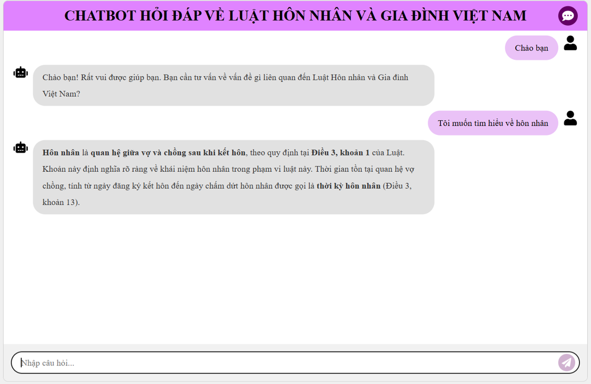

# 🤖 Q&A ChatBot on Vietnamese Marriage and Family Law


## 📖 Introduction

The **Q&A ChatBot on Vietnamese Marriage and Family Law** is a tool designed to assist users in finding information about legal regulations related to marriage and family in Vietnam. The ChatBot utilizes modern AI technologies such as **Advanced Retrieval-Augmented Generation (RAG)**, **vector database**, and **graph database** to provide detailed answers based on legal data.

## 🛠️ Key Features

- **Answer Questions on Marriage and Family Law**: The ChatBot can quickly and accurately answer questions related to Vietnamese Marriage and Family Law.
  
- **Display Specific Legal Provisions**: Instead of searching through lengthy legal documents, users can simply ask questions, and the ChatBot will retrieve the relevant legal provisions.

- **Integrated Friendly Chat**: The ChatBot is capable of friendly conversation, making users feel comfortable while learning about the law.

## 🏗️ Architecture


### 🖥️ Frontend
- **Technology**: Built using **ReactJS** for the user interface.
- **Functionality**: Supports natural language communication with the ChatBot.

### ⚙️ Backend
- **Technology**: Built using **FastAPI** for API and business logic processing.
- **Advanced RAG**: Integrated for quick information retrieval and context-based answers.
- **Database**:
  - **Qdrant**: Vector database for storing and searching embedded text vectors.
  - **Neo4j**: Graph database for managing relationships between legal provisions.

### 📂 Data
- **Vietnamese Marriage and Family Law 2014 (Document 52/2014/QH13)**, published on the Government's website.

## 🔧 Installation

### 📋 System Requirements
- Python (v3.8 or higher)
- Node.js (v18 or higher)

### 📝 Installation Steps

1. Clone the repository:
```sh
git clone https://github.com/22520896/LawChatBot.git
```

2. Install the required libraries:
```sh
pip requirement.txt
```

3. Create a cluster on [Qdrant Cloud](https://cloud.qdrant.io/) and obtain the connection details (URL and API Key).

4. Create an instance on [Neo4j Aura] (https://neo4j.com/cloud/aura/), then obtain the connection details (URI, username, password).

5. Create a **Google API Key** from [Google AI Studio](https://aistudio.google.com/apikey).

6. Create a .env file in the project's root directory and add the following environment variables:
```sh
# Google API
GOOGLE_API_KEY=

# Qdrant config
QDRANT_COLLECTION_NAME=
QDRANT_URL=
QDRANT_API_KEY=

# Neo4j config
NEO4J_PASS=
NEO4J_USERNAME=
NEO4J_URI=
```   

7. Save data to Qdrant:
```sh
python data/save_to_vectordb.py
```

8. Save data to Neo4j:
```sh
python data/save_to_graphdb.py
```

9. Install FrontEnd:
```sh
cd FrontEnd
npm install
```

### 🚀 Usage
1. Start the BackEnd:
```sh
cd BackEnd
uvicorn app:app
```

2. Start the FrontEnd
```sh
cd FrontEnd
npm rundev
```

3. Access the web interface at: http://localhost:5173.

4. Enter your questions and receive answers from the ChatBot.