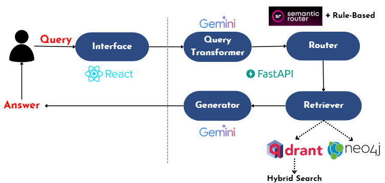

# Chatbot Hỏi Đáp Về Luật Hôn Nhân và Gia Đình Việt Nam

## Giới Thiệu

Hệ thống **Chatbot Hỏi Đáp về Luật Hôn Nhân và Gia Đình Việt Nam** là một công cụ hỗ trợ người dùng tìm kiếm thông tin về các quy định pháp luật liên quan đến hôn nhân và gia đình tại Việt Nam. Chatbot sử dụng các công nghệ AI hiện đại như **Avanced Retrieval-Augmented Generation (RAG)**, **vector database** và **graph database** để cung cấp câu trả lời chi tiết, dựa trên dữ liệu pháp luật.

## Tính Năng Chính

- **Trả lời câu hỏi về Luật Hôn Nhân và Gia Đình**: Chatbot có khả năng trả lời các câu hỏi liên quan đến luật Hôn nhân và Gia đình Việt Nam một cách nhanh chóng và chính xác.
  
- **Hiển thị điều luật cụ thể**: Thay vì phải tìm kiếm trong toàn bộ văn bản pháp luật dài dòng, người dùng chỉ cần đặt câu hỏi và chatbot sẽ truy xuất chính xác điều luật phù hợp.

- **Tích hợp trò chuyện xã giao**: Chatbot có khả năng trò chuyện thân thiện, giúp người dùng cảm thấy thoải mái khi tìm hiểu về pháp luật.

## Kiến Trúc


### Frontend
- **Công nghệ**: Sử dụng **ReactJS** để xây dựng giao diện người dùng.
- **Chức năng**: Hỗ trợ chatbot giao tiếp bằng ngôn ngữ tự nhiên.

### Backend
- **Công nghệ**: Sử dụng **FastAPI** để xây dựng API và xử lý logic nghiệp vụ.
- **Advanced RAG**: Tích hợp để tìm kiếm thông tin nhanh và cung cấp câu trả lời dựa trên ngữ cảnh.
- **Database**:
  - **Qdrant**: Vector database để lưu trữ và tìm kiếm embedded vector của văn bản.
  - **Neo4j**: Graph database để quản lý các mối quan hệ giữa các điều luật.

### Dữ Liệu
- **Luật Hôn nhân và Gia đình Việt Nam 2014 (Văn bản 52/2014/QH13)**, được đăng tải trên trang Chính phủ.

## Cài Đặt

### Yêu Cầu Hệ Thống
- Python (v3.8 trở lên)
- Node.js (v18 trở lên)

### Các Bước Cài Đặt

1. Clone repository:
```sh
git clone https://github.com/22520896/LawChatBot.git
```

2. Cài đặt các thư viện:
```sh
pip requirement.txt
```

3. Tạo một cluster trên [Qdrant Cloud](https://cloud.qdrant.io/) và lấy thông tin kết nối (URL và API Key).

4. Tạo một instance trên [Neo4j Aura](https://neo4j.com/cloud/aura/) hoặc cài đặt Neo4j Desktop, sau đó lấy thông tin kết nối (URI, username, password).

5. Tạo **Google API Key** từ [Google AI Studio](https://aistudio.google.com/apikey)

6. Tạo một file .env trong thư mục gốc của dự án và thêm các biến môi trường sau:
```sh
# Google API
GOOGLE_API_KEY=

# Qdrant config
QDRANT_COLLECTION_NAME=
QDRANT_URL=
QDRANT_API_KEY=

# Neo4j config
NEO4J_PASS=
NEO4J_USERNAME=
NEO4J_URI=
```   

7. Lưu dữ liệu vào Qdrant:
```sh
python data/save_to_vectordb.py
```

8. Lưu dữ liệu vào Neo4j:
```sh
python data/save_to_graphdb.py
```

9. Cài đặt FrontEnd
```sh
cd FrontEnd
npm install
```

### Cách sử dụng
1. Khởi chạy BackEnd:
```sh
cd BackEnd
uvicorn app:app
```

2. Khởi chạy FrontEnd
```sh
cd FrontEnd
npm rundev
```
3. Truy cập giao diện web tại: http://localhost:3000.

4. Nhập câu hỏi và nhận câu trả lời từ chatbot.